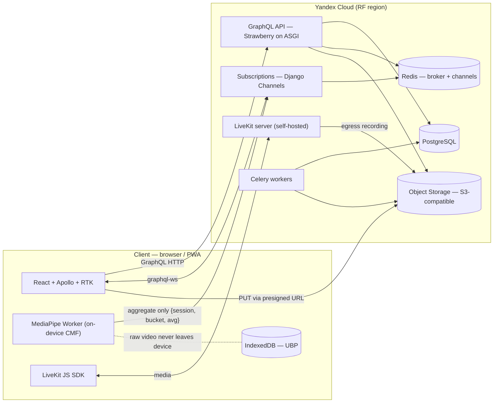
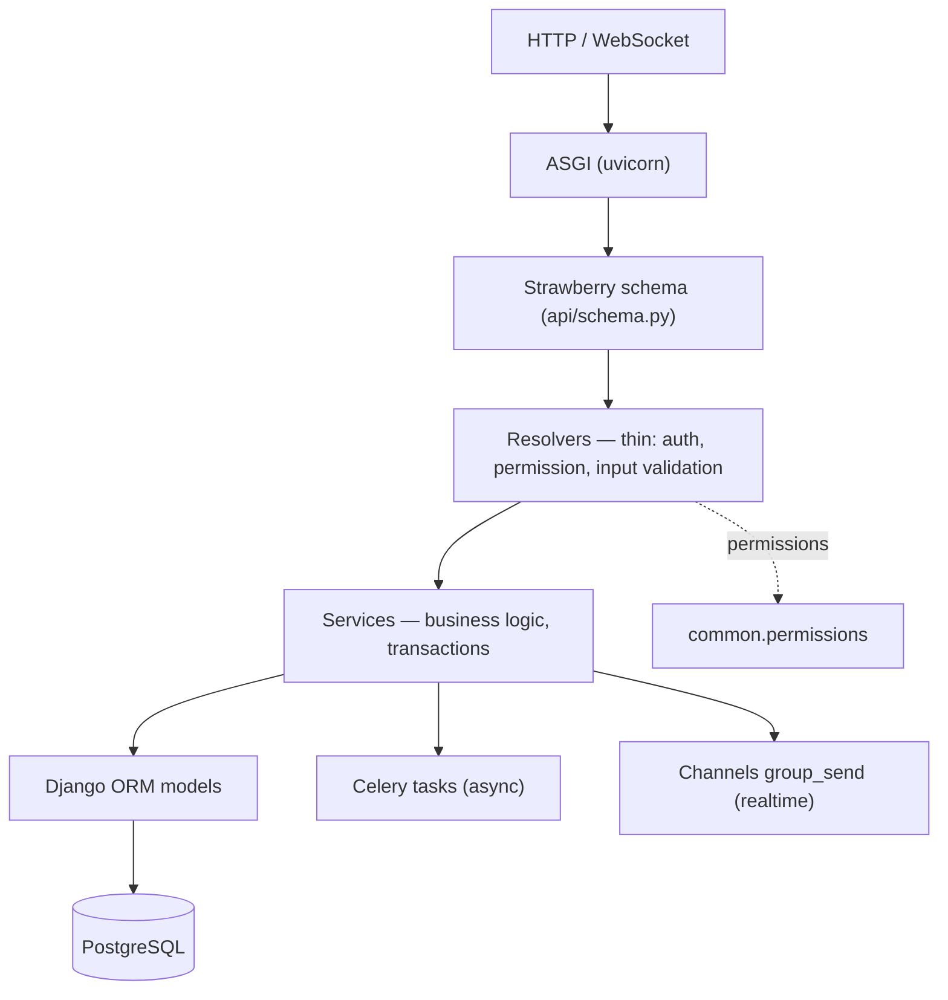
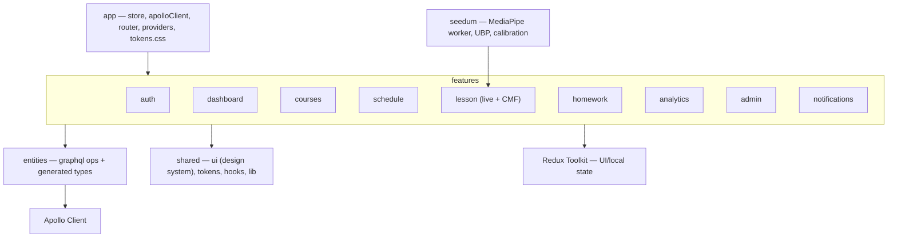

# Flamingo — Architecture

**Version:** 1.0 · **Date:** 2026-06-13 · **Status:** layer/structure spec for Stage 5 coding.
Builds on `flamingo_erd.md` (data), `flamingo_schema.graphql` (API contract) and `CLAUDE.md` (rules). Entities map 1:1 to models; the API mirrors the SDL.

---

## 1. System overview

The dashed line is the privacy boundary: camera frames and per-frame features stay on the device; only attention aggregates cross the network.

---

## 2. Backend architecture

### 2.1 Request lifecycle (layers)

Rule: resolvers never contain business logic. They resolve the viewer, check permission, validate input, then call a **service** function which owns the transaction and side effects. This keeps the GraphQL layer mechanical and testable, and lets future surfaces (mobile, admin scripts) reuse services.

### 2.2 Apps & responsibilities

| App | Core models | Services (examples) | GraphQL surface |
|---|---|---|---|
| `accounts` | USER, *_PROFILE, GUARDIANSHIP, VERIFICATION_DOCUMENT | register, login, refresh, add_child, give_consent, submit_verification | `me`, auth mutations, guardianship, teacher card |
| `institutions` | INSTITUTION, INSTITUTION_MEMBERSHIP, GROUP, GROUP_MEMBERSHIP, GROUP_TEACHER | create_institution, invite_member, create_group, assign_teacher | institution/group queries, admin mutations |
| `courses` | COURSE, SECTION, LESSON, MATERIAL, ENROLLMENT | create/update/publish course·section·lesson, reorder, enroll, mark_viewed | catalog, course, lesson, enrollment |
| `scheduling` | LESSON_SESSION, ATTENDANCE | schedule_session, start/end/join_session, set_attendance, livekit_token | schedule, session, attendance, session subs |
| `homework` | HOMEWORK, SUBMISSION, SUBMISSION_FILE | create/publish homework, submit, grade | homework, submissions, grading mutations |
| `seedum` | ATTENTION_METRIC, UBP_BACKUP, RECOMMENDATION | ingest_attention, rollup analytics, backup_ubp | analytics queries, attentionUpdates sub, UBP |
| `engagement` | ACHIEVEMENT, USER_ACHIEVEMENT, POINT_EVENT, REVIEW | award_points, recompute_leaderboard, create/moderate review | leaderboard, achievements, reviews |
| `certificates` | CERTIFICATE | issue_certificate (PDF+QR), verify | certificate, public `verifyCertificate` |
| `notifications` | NOTIFICATION, NOTIFICATION_PREFERENCE | notify (fan-out push/email/in-app), mark_read | notifications, prefs, notification sub |

### 2.3 `common/` (shared foundation)
- **BaseModel**: `id UUIDField(pk, default uuid4)`, `created_at`, `updated_at`; `SoftDeleteModel` adds `deleted_at` + a default manager filtering it out.
- **enums.py**: single source for the ERD §4 enums (Django `TextChoices`), reused by models and GraphQL.
- **storage.py**: object-storage client — `presign_put(purpose, filename, content_type) -> (url, key)`, `presign_get(key)`. DB holds keys only.
- **permissions.py**: role gates + object-level helpers (see §2.5) usable from resolvers/services.
- **pagination.py**: cursor-connection helpers (`to_connection(queryset, first, after)`).
- **auth.py**: JWT encode/decode, `get_context()` populating `info.context.user`.

### 2.4 Auth & sessions
JWT access (short-lived) + refresh (rotating). `login`/`registerUser` return both; `refreshToken` rotates. Strawberry context resolves the user from the `Authorization` header (and from the WS connection params for subscriptions). Email verification and password reset issue signed tokens delivered by a Celery email task.

### 2.5 Permissions model
Authorization is **server-side, per resolver/field, and object-level** — never derived from a client-supplied role/id.

| Role | Can read | Can write |
|---|---|---|
| Student | own enrollments, schedule, submissions, metrics, certificates | own submissions, enroll, mark viewed, own UBP backup |
| Parent | linked children only (via active GUARDIANSHIP with consent) | child account creation/consent, notification prefs |
| Teacher | own courses/lessons/sessions, their groups' analytics, submissions to their homework | course/lesson CRUD, schedule, grade, attendance |
| Admin | their institution's users/groups/reports | institution settings, invites, groups, branding, review moderation |

Queries are **scoped** (e.g. `mySubmissions` filters by `info.context.user`; `parentChildOverview(childId)` asserts an active guardianship). List queries never leak cross-tenant rows.

### 2.6 GraphQL schema assembly
`strawberry-django` types live per app under `apps/<x>/graphql/{types,queries,mutations,subscriptions}.py`. `api/schema.py` composes the root `Query`/`Mutation`/`Subscription`. `python manage.py export_schema api.schema` writes `docs/flamingo_schema.graphql` — the SDL is the **contract**; FE codegen consumes it. CI fails if the exported SDL drifts from the committed file.

### 2.7 Realtime (subscriptions over Channels)
WebSocket via `graphql-ws`, transported by Django Channels with a **Redis channel layer**. Pattern: a mutation/service calls `channel_layer.group_send(group, payload)`; subscribers resolve from the group.
- `reportAttention` → ingest aggregate → `group_send("attn:{session}", metric)` → **`attentionUpdates`** subscribers (the teacher's class view). Payload is an aggregate, never media.
- `startSession`/`endSession` → `sessionStatusChanged`.
- `sendChatMessage` → `chatMessageReceived`.
- `notify()` → `notificationReceived` for the target user.

### 2.8 Files (object storage)
`requestUpload` returns a presigned **PUT** URL + `fileKey`; the client uploads bytes directly to Yandex Object Storage; the follow-up mutation (e.g. `submitHomework`, `addMaterial`) stores the `fileKey`. Reads use presigned **GET** (or CDN). No file bytes pass through GraphQL.

### 2.9 Video (LiveKit)
`startSession` (teacher) and `joinSession` (student) call `scheduling` services that mint a **LiveKit room JWT**: room = session id, identity = user id, grants by role (publish for teacher/participants, subscribe always). Recording uses LiveKit **egress** to S3; an egress webhook (or worker) writes `recording_key` and flips the session to `ENDED`. The `roomToken` field is only populated for a participant of a live session.

### 2.10 Async (Celery + Redis)
| Task | Trigger | Notes |
|---|---|---|
| finalize_recording | LiveKit egress webhook | set `recording_key`, status ENDED, notify students |
| generate_certificate | course completion / final test pass | PDF+QR via the `pdf`/`official-documents` skill; store `pdf_key`, `verification_uuid` |
| recommend | nightly batch | rule-based over ATTENTION_METRIC + grades → RECOMMENDATION rows |
| weekly_digest | weekly schedule | parent digest email |
| send_notification | on notify() | push/email fan-out per NOTIFICATION_PREFERENCE |

### 2.11 SEduM server side
`ingest_attention` validates `avg_attention` ∈ 0–100 and the bucket, writes one `ATTENTION_METRIC` row, and fans out to subscribers. Analytics (per subject, per weekday, session summary, group rollups) are **queries over ATTENTION_METRIC** — no extra raw data. `UBP_BACKUP` stores an opaque encrypted blob. **Invariant (with a test):** no resolver, mutation, or HTTP route accepts raw video/audio/frames.

### 2.12 Config
`config/settings/{base,dev,prod}.py`; `config/asgi.py` serves HTTP (Strawberry) + WS (Channels) in one ProtocolTypeRouter. Region-pinned storage/DB. Secrets via env (`.env.example` documents them).

---

## 3. Frontend architecture

### 3.1 Layers

Dependency direction is one-way: `features` depend on `entities`/`shared`; nothing depends back on `features`. `app` wires everything; `shared` and `entities` know nothing about specific features.

### 3.2 `app/`
- `store.ts` — RTK store (UI slices only).
- `apolloClient.ts` — link chain + cache (§3.3).
- `router.tsx` — role-aware, protected routes (§3.10).
- `providers.tsx` — ApolloProvider, Redux Provider, I18nProvider, and a Theme/AgeMode provider that sets `data-theme` / `data-mode` on the root.
- imports `shared/styles/tokens.css` once at the root.

### 3.3 Apollo Client
- **Link chain:** `errorLink` (global GraphQL/network error handling, 401 → silent refresh) → `authLink` (inject access token) → `split(isSubscription, wsLink(graphql-ws), httpLink)`.
- **InMemoryCache:** `keyFields: ['id']` for entities; **connection merge** field policies for `catalog` and `notifications` (paginated); field policies for viewer-scoped fields.
- **Fetch policy:** `cache-and-network` for dashboards; `cache-first` for static content.
- **Optimistic updates** for `gradeSubmission`, `reorderSections`/`reorderLessons`, `markNotificationRead`, `dismissRecommendation`.
- Typed hooks come from codegen (§3.9) — no hand-written response types.

### 3.4 State split (Apollo vs Redux)
Apollo owns **server state**. Redux Toolkit owns **UI/local state only** — do not mirror server data into Redux.
- `uiSlice` — theme, age mode, open modals, toasts.
- `sessionSlice` — live-lesson local UI: mic/cam, calibration progress, the **local** attention series rendered on the student's chart (never persisted to the server).
- `builderSlice` — course/lesson constructor wizard/stepper and drag-and-drop order before save.
- **Auth tokens:** access token in memory; refresh handled by `errorLink` on 401. Refresh-token storage: prefer an httpOnly cookie set by the server; if client-managed, keep it in secure storage and rotate on every refresh.

### 3.5 Feature anatomy
`features/<name>/{ ui/ (screens + components), graphql/ (*.graphql operations), model/ (optional slice/hooks), index.ts }`. Mapping to the prototypes/screen IDs:

| Feature | Prototype screens |
|---|---|
| `auth` | AUTH-001…009 (role select, role forms, login, reset) |
| `dashboard` | STUDENT-JR/SR-001, STUDENT-AD-001, PARENT-002, TEACHER-001, ADMIN-001 |
| `courses` | catalog + course card + constructor (TEACHER-002…006), enrollment |
| `schedule` | STUDENT-*-003, ADMIN-011, calendar |
| `lesson` | live + CMF (STUDENT-JR/SR-004/005, TEACHER-007), report (…-006) |
| `homework` | STUDENT-*-006/007, TEACHER-009…011, grading |
| `analytics` | STUDENT-SR-010, PARENT-005, TEACHER-012, ADMIN-012…016 |
| `admin` | ADMIN-002…010, 018…020 (institution, users, groups, branding) |
| `notifications` | *-Уведомления + preferences |
| `profile` | profiles, certificates, achievements |

### 3.6 Design-system integration
`shared/ui` mirrors `FlamingoStyleguide.jsx` (buttons, inputs, cards, table, tabs, modal, toasts, charts, etc.). Styling = **CSS Modules consuming `tokens.css`**; only semantic tokens, never raw hex/px. Theming and age adaptation are driven by `data-theme` / `data-mode` on the root (size/leading/tap cascade automatically); content-level age variants are per-component. Charts are inline SVG on tokens, as in the prototypes.

### 3.7 SEduM module (`seedum/`)
- `mediapipe.worker.ts` — `FaceLandmarker` (WASM) in a Web Worker; derives an attention score locally.
- `attentionPipeline.ts` — buffers scores into ~10 s buckets, throttles, and emits `reportAttention({ sessionId, bucketStart, avgAttention })`. **Never** posts frames/landmarks.
- `calibration.ts` — the «база-тест» / pre-join calibration.
- `ubp.ts` — UBP in IndexedDB; optional cloud backup encrypts client-side via WebCrypto, then `backupUbp` stores the opaque blob.
- The teacher's class view subscribes to `attentionUpdates`; the on-device privacy indicator is shown on every camera screen.

### 3.8 i18n
`i18next` with `ru` namespaces per feature. No hardcoded strings; locale-aware date/number formatting. The architecture is locale-agnostic even though only `ru` ships.

### 3.9 Codegen
`codegen.ts` reads `docs/flamingo_schema.graphql` + feature `*.graphql` operations and generates typed hooks/types into `entities/graphql/generated`. Run on any schema or operation change; CI checks it is current.

### 3.10 Routing & guards
Public: landing, login, register, **`/verify/:verificationId`** (uses public `verifyCertificate`). Authenticated areas branch by role; a `ProtectedRoute` redirects unauthenticated users and routes each role to its area. The root `data-mode` is set from the student's `ageBand`.

### 3.11 Conventions
Skeletons for loading; error boundaries per route; optimistic UI where listed; controlled forms with inline validation matching the input field component states.

---

## 4. Main scenario across the stack
Teacher creates course → student enrolls → CMF lesson → homework → grade → parent sees:
1. **Teacher** `createCourse`/`createSection`/`createLesson` → `courses` services → COURSE/SECTION/LESSON; `publishCourse` notifies the group.
2. **Student** `enroll` → ENROLLMENT; sees the session in `mySchedule`.
3. **Live**: `joinSession` mints a LiveKit token + ATTENDANCE; the `seedum` worker computes attention locally and pushes aggregates via `reportAttention`; the teacher watches `attentionUpdates`; `endSession` triggers `finalize_recording`.
4. **Homework**: `submitHomework` (files via presigned upload) → SUBMISSION; teacher `gradeSubmission` (optimistic) → score/comment.
5. **Notify**: grading calls `notify()` → `notificationReceived` for the student; a parent digest/notification updates the **parent** dashboard (`parentChildOverview`) with the new grade and attention trend — all from aggregates.

---

## 5. Environments
`infra/docker-compose.yml` runs postgres, redis, livekit, minio (S3-compatible), backend (ASGI), frontend (Vite). Prod on Yandex Cloud with region-pinned storage/DB; Kubernetes later. Secrets via env.

## 6. Next
Code by module, in order: **auth → role cabinets → schedule/lessons → homework/grades → admin → SEduM Lite.**
