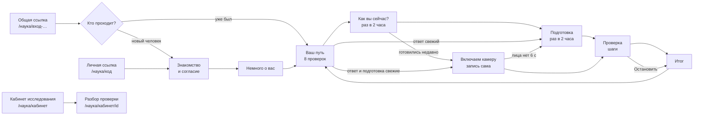

# Исследование внимания — передача экранов

> Спецификация экранов исследования и кабинета исследования: что на каждом экране,
> в каких он бывает состояниях, что нажимается, какие слова и откуда данные.
> По ней экран можно пересобрать, проверить или поменять, не читая весь код.
>
> Как экраны устроены внутри — `docs/дизайн/ИССЛЕДОВАНИЕ-ДИЗАЙН-СИСТЕМА.md`.
> Зачем исследование и как выкатывать — `docs/SEDUM-ИССЛЕДОВАНИЕ.md`.
>
> Состояние на 06.10.2026. Холст из 11 экранов и 10 шагов «Точной настройки»
> утверждён владельцем; экраны 10–11 (кабинет и разбор) сделаны по нему.

---

## 0. Карта

| Адрес | Кто открывает | Что там |
|---|---|---|
| `/наука/вход-<секрет>` | любой, кому Адель отправил ссылку | «Кто проходит?» → дальше по карте |
| `/наука/<код>` | один конкретный человек | сразу к нему: знакомство или путь |
| `/наука/кабинет` | только владелец, после входа во Flamingo | люди, проверки, итоги, ссылка, выгрузка |
| `/наука/кабинет/<id>` | только владелец | разбор одной проверки: видео + что решила система |

Рабочие кадры — 1280×800 и 1512×944, без прокрутки страницы. Телефон (≤ 760) —
один столбец, лист прокручивается. Каждый экран ниже есть на стенде:
`/стенд?э=<имя>`.

---

## 1. Кто проходит? — `наука-кто`

**Зачем.** По общей ссылке проходит много людей с одного компьютера. Экран спрашивает,
кто сейчас за ним, чтобы записи не перепутались.

**Состав.** Заголовок «Кто сейчас проходит?», «На этом устройстве проверки уже
проходили.»; список людей, которые уже проходили здесь (имя, сколько проверок, когда
последняя); кнопка «Я здесь впервые — спросим имя и покажем, что записываем». Внизу:
«Записи видит только Адель. Проверку можно остановить в любой момент.» Справа —
рисунок глаза.

**Данные.** Список людей — в памяти браузера (`люди.ts`), на сервер не уходит.

**Состояния.** Людей здесь нет — экран пропускается, сразу знакомство. «Это не я» в
шапке любого экрана возвращает сюда же.

## 2. Знакомство и согласие — `наука-знакомство`, `наука-знакомство-личная`

**Состав.** Слева: «Помогите научить Flamingo замечать внимание», лид, лист из четырёх
клеток — «Что будет», «Что записываем», «Где хранится и кто видит», «Это добровольно».
Справа — лист с полем «Как вас зовут» (только по общей ссылке) и галочкой согласия.
Снизу — строка подсказки и «Согласен(на), дальше».

**Подсказка внизу ведёт человека:**

| Что не сделано | Строка |
|---|---|
| нет галочки | «Поставьте галочку — без согласия записывать нельзя.» |
| нет имени (общая ссылка) | «Напишите имя — так Адель поймёт, чьи это записи.» |
| всё готово | «Готово — дальше пара вопросов о вас.» |
| сервер не принял | «Согласие не сохранилось — проверьте интернет и нажмите ещё раз.» |

**Данные.** `GET /api/science/join/<токен>` проверяет ссылку, `POST` заводит человека →
`POST /api/science/v/<код>/consent` с версией согласия. Версия на странице и на сервере
сверяется в `наука-check.mjs`.

## 3. Немного о вас — `наука-о-вас`

**Состав.** «Немного о вас, {имя}» и «Всё по желанию…». Поля: Возраст; Пол; Очки или
линзы; Какой рукой пишете; «Что ещё нам стоит знать» — во всю ширину листа. «Кто вы на
уроке» убран (владелец, 06.10: для сбора записей не важно); в кабинете у человека
вместо роли — возраст и очки: «41 год · очки». Внизу: «Всё по желанию — можно пропустить.», кнопки
«Пропустить» и «Дальше — к пути».

**Правило.** Ни одно поле не обязательно. **Данные.** `POST /api/science/v/<код>/profile`.

## 4. Ваш путь — `наука-путь`, `наука-путь-пройдено`

**Состав.** «Ваш путь, {имя}», «Восемь проверок. Любую можно пройти снова…». Карта —
восемь проверок по пунктирной дороге, у каждой знак, название, минуты. Справа — лист
выбранной проверки: суть, «Понадобится: …», камера/микрофон, «Когда вы проходили»
(утро / день / вечер). Внизу — «пройдено 3 из 8 · записано 14 мин» и «Начать «{проверка}»»
(или «Пройти «…» ещё раз»).

| Проверка | Мин | Камера |
|---|---|---|
| Точная настройка — лучше первой | 4 | да |
| Куда я смотрю | 4 | да |
| Тетрадь, телефон, книга | 5 | да |
| Глаза и сон | 5 | да |
| Подумайте | 4 | да |
| Следите за точкой | 4 | да |
| Чтение — 2,5 минуты, статьи по 370–510 слов (владелец, 06.10: «сократить в два раза») | 4 | да |
| Голос учителя — для учителей | 7 | нет |

**Состояния.** Пройдена — значок получен; остановлена — серый значок, не засчитана;
следующая — выбрана сама (`следующая()`). Все три времени дня есть — «Утро, день и
вечер — все есть. Спасибо!».

## 5. Как вы сейчас? — `наука-как-вы`

**Состав.** По центру один лист: «Как вы сейчас?»; бегунок «Насколько вас клонит в сон»
1–9 со словами шкалы («Ни бодро, ни сонно», «Сонно, приходится бороться со сном»…);
«Свет в комнате»; «Вы сейчас в очках» (только у проверок с камерой); «Где вы». Внизу —
«Назад к пути» и «Дальше».

**Правила.**
- Пока бегунок не тронут, вместо слов — «Передвиньте бегунок», «Дальше» закрыта.
- **Раз в два часа** (владелец, 06.10): ответ живёт 2 часа (`ОТВЕТ_ЖИВЁТ_МС`). Пока он
  свежий, следующая проверка начинается без этого экрана.

**Данные.** Ответы уходят в проверку полем `перед` и видны в кабинете (столбцы «Сон»,
«Свет») и в разборе (плашки).

## 6. Подготовка — `наука-подготовка`, `…-запрещено`, `…-голос`

**Состав.** «Подготовка»: окно камеры с сеткой лица, знак «камера видит лицо целиком,
света достаточно»; «Понадобится» с «— или просто имитируйте эти действия»; у «Голоса» —
«Проверить звук» и «Слышу сигнал». Внизу — «Назад к пути» и «Начать запись».

| Состояние | Что видно |
|---|---|
| камера разрешена, лицо в кадре | зелёный знак, «Начать запись» открыта |
| браузер спрашивает | «Браузер спрашивает разрешение в окошке у адресной строки.» |
| запрещено | «Нет доступа к камере» — «Разрешите камеру и микрофон в настройках сайта — значок замка в адресной строке — и обновите страницу.», «Обновить страницу» |
| нет камеры | «Камера не найдена» — «Подключите камеру и обновите страницу. Проверки идут только с камерой: по ней система и учится.» |
| модель грузится | «Загружаем модель лица» — «Около 15 МБ в первый раз; дальше браузер помнит её сам.» |
| модель не загрузилась | «Модель лица не загрузилась» и «Обновить страницу» |

**Раз в два часа** (владелец, 06.10: «каждый раз она не нужна»). Подготовка — у первой
проверки и снова, если с последней записи прошло больше двух часов (`свежаяПодготовка`,
`люди.ts`; у «Голоса учителя» — своя отметка: там проверяется микрофон). Иначе после
«Начать «…»» на пути — экран **«Включаем камеру»** (`наука-начинаем`): «Запись начнётся
сама, как только камера увидит лицо», внизу «Камеру и звук вы уже проверили — подготовка
не нужна.» и «Назад к пути». Запись начинается сама, как только модель видит лицо при
хорошем свете; камера не открылась или лица нет 6 секунд — подготовка, как в первый раз.
Нажатие «Начать «…»» на пути и есть согласие начать: звук заводится на нём же (Safari
включает звук только по нажатию).

Перед каждым шагом — 3 секунды прочитать подсказку (`ПОДГОТОВКА_СЕК`), они не оцениваются.

## 7. Проверка — шаги

Общий каркас: в шапке — название и «шаг 4 из 10»; в полоске — огонёк «идёт запись» и
отрезки шагов (`role="progressbar"`); на поле — крупная команда шага; внизу —
«Остановить проверку».

| На стенде | Что на поле |
|---|---|
| `наука-калибровка` | точка, на которую смотреть; бьётся как сердце — «тук-тук» и пауза, 70 в минуту |
| `наука-перед-шагом` | что сейчас попросят, отсчёт |
| `наука-камера`, `наука-моргай`, `наука-глаза-закрыты` | шаги «Точной настройки» и «Глаз и сна» |
| `наука-учитель`, `наука-доска` | «посмотрите на учителя / на доску» — картинка урока |
| `наука-тетрадь-бумага`, `наука-тетрадь-пишет` | предложение, которое переписать; «или имитируйте» |
| `наука-точка` | движущаяся точка |
| `наука-подумайте` | вопрос крупно и «Ответил(а)» |
| `наука-чтение` | книга разворотами: «Назад», «Перевернуть страницу» |
| `наука-где-внимание` | «Где было внимание?»: на тексте / в своих мыслях / вокруг / в телефоне |
| `наука-понимание` | «Три вопроса о тексте «…»», затем «Продолжить чтение» |
| `наука-фраза`, `наука-урок-голосом` | «Записать заново», «Пропустить», «Готово»; «Закончить урок» |

**«Прочитайте текст» — каждый раз другой** (владелец, 06.10). Двадцать коротких научных
фактов (`тексты.ts → КОРОТКИЕ`): внутри проверки не повторяются, между проверками сначала
идут те, которых человек ещё не читал (`люди.ts → прочитано`); книга «Чтения» тоже
начинается с непрочитанной статьи. С книгой короткие тексты не пересекаются.

**Сигнал «вернитесь к экрану»** — двумя путями (`звук.ts`): Web Audio, а если браузер его
приостановил (Safari — при включении микрофона), тот же тон играет аудиоэлемент. Оба
заводятся на нажатии «Начать «…»» на пути.

**Остановка.** «Остановить проверку» → в той же полосе «Остановить проверку? Записанное
сохранится.» и «Продолжить» / «Остановить». Остановленная проверка уходит на итог с
пометкой «остановлена».

**Данные.** `POST /api/science/v/<код>/runs` открывает проверку; куски видео, кадров,
событий и звука идут `PUT …/runs/<id>/<вид>/<n>` по ходу; `POST …/finish` закрывает
со сводкой (`лицо`, `совпало`, `прервано`). Видео, кадры и события считаются от одной
точки — начала записи.

## 8. Итог — `наука-итог`, `…-готово`, `…-голос`, `…-остановлена`

**Состав.** «Вот что система о вас заметила», «Это не оценка — просто то, как вы
смотрите…». Карточки с числами — свои у каждой проверки (`итоги.ts`): у «Точной настройки» —
«Моргания» за 10 секунд, «Без моргания», «Поворот головы»; у «Куда я смотрю» —
«Совпало», «Заметила отвод», «Моргания»; у «Глаз и сна» — «Засыпаю», «Зевки»; у
«Подумайте» — «Взгляд в сторону», «Дольше всего»; у чтения — «Дошли до страницы» (из M), «Слов в минуту»,
«Ответы». Нечего посчитать — вместо числа «—» и объяснение словами. Лента глаз со
сносками («Цифры о морганиях: Bentivoglio и др., 1997»). Справа — новый значок. Внизу —
«К пути».

| Состояние | Строка внизу |
|---|---|
| запись ещё уходит | «отправляем запись» |
| всё на сервере | «Запись уже на сервере. Можно пройти другую проверку сейчас или вернуться позже.» |
| остановлена | «Проверка остановлена — записанное уже у нас.», значок серый |
| морганий не видно | «Морганий система в этот раз не разглядела — так бывает, когда лицо далеко или в тени.» |

## 9. Отказы — `наука-нет-ссылки`, `наука-ссылка-погашена`, `наука-молчит`

| Когда | Что сказано | Что сделать |
|---|---|---|
| ссылка неполная | «Ссылка не найдена» — «Похоже, она скопировалась не целиком. Откройте её ещё раз из сообщения — или попросите прислать заново того, кто её дал.» | — |
| ссылку сменили | «Эта ссылка больше не действует» — «Попросите новую у того, кто её прислал. Если вы уже проходили проверки, ваши записи никуда не делись.» | — |
| сервер не ответил | «Сервер не отвечает»; «Записанное раньше в сохранности.» | «Попробовать ещё раз» |

---

## 10. Кабинет исследования — `наука-кабинет`, `…-сменить`, `…-пусто`, `…-вход`

**Кто видит.** Только владелец: сервер сверяет почту вошедшего с `SCIENCE_OWNERS` в
`.env`. Не вошёл — «Войдите в Flamingo — кабинет исследования открывается после входа.»
и «Войти» (после входа человек возвращается в кабинет). Вошёл не владелец — «Кабинет
исследования открыт только владельцу…». Ни имён, ни счёта записей чужому не уходит.

**Состав.** Шапка: «Кабинет исследования», справа «Скачать без видео» и «Скачать всё».
Полоска: «доска исследования · кабинет», справа «видишь только ты». Три столбца:

| Столбец | Что | Как |
|---|---|---|
| Люди · N | каждый человек: буква, имя, анкета коротко, «2/8» пройдено | выбранный — сильной рамкой; длинный список прокручивается внутри |
| {Имя} · N проверок | таблица: Проверка (и «остановлена»), Когда, Длина, Сон, Свет, Лицо, Совпало, ▶ | ▶ — «Разбор: {проверка}, {когда}»; под таблицей — что значат «Сон», «Лицо», «Совпало» |
| Всего / Ссылка для всех | людей, проверок, записи (мин), на сервере, свободно; ссылка, «по ней вошло: N человек» | «Скопировать», «Сменить» |

**«Сменить» — в два шага.** Первое нажатие открывает в карточке: «Сменить ссылку? Старая
перестанет пускать новых людей; кто уже проходил, останется со своими записями.» —
«Отмена» и «Сменить». Без подтверждения сервер ссылку не меняет (нужно
`{"сменить": true}`).

**Пусто.** «Пока никто не прошёл ни одной проверки»; ссылка для всех на месте — её можно
сразу отправить.

**Выгрузка.** Архив `.tgz` собирается на сервере потоком, не занимая диск:
`nauka-<дата>-bez-video.tgz` или с видео. Записи не кэшируются по дороге
(`Cache-Control: private, no-store`).

**Данные.**

| Запрос | Ответ |
|---|---|
| `GET /api/science/cabinet` | люди, всего, ссылка |
| `GET /api/science/cabinet/v/<код>` | человек и его проверки |
| `GET /api/science/cabinet/runs/<id>` | одна проверка: устройство, итог, список кусков |
| `GET /api/science/cabinet/runs/<id>/<вид>/<n>` | кусок: видео, кадры, события, звук |
| `POST /api/science/cabinet/link` | новая ссылка (тело JSON `{"сменить": true}`) |
| `GET /api/science/cabinet/archive?video=0\|1` | архив потоком |

## 11. Разбор проверки — `наука-разбор`

**Зачем.** Посмотреть видео и рядом — что человека просили сделать, что в этот момент
решила система и какие были числа. Так видно, где система ошибается.

**Состав.** Шапка: «← Кабинет», «{Имя} · {Проверка}», время и длина. Полоска справа —
плашки условий: «сонливость 3 из 9», свет, «без очков», «Mac · Chrome», огонёк
«остановлена». Верхний ряд: видео со своими кнопками плеера; «На 2:39 просили» (шаг,
«шаг 8 из 14 · ждали «глаза закрыты»») и «Система решила» («Совпало.»); «Числа в этот
момент» — раскрытие век (и норма), поворот и наклон головы, взгляд вниз, «глаза закрыты,
минута», качество кадра. Снизу — «Вся проверка»: лента из трёх дорожек и итог
«совпало на 14 из 14 оцениваемых шагов».

**Управление.**
- Щелчок по ленте — видео встаёт в этот момент; стрелки ← → — на 5 секунд.
- Видео играет — курсор ленты и обе карточки идут за ним.
- Пока запись грузится — «Загружаем запись: 3 из 12».

**Видео.** Браузер пишет видео без длины в файле; страница один раз узнаёт длину, чтобы
работал ползунок плеера. Видео встаёт в рамку целиком, кнопки плеера не срезаются.

**Состояния.** Нет видео — «Видео у этой проверки нет.»; у «Голоса учителя» —
«У «Голоса учителя» видео нет — только фразы со звуком.»; калибровку не закончили —
на ленте она идёт до конца записи.

---

## 12. Что проверено перед передачей (06.10)

| Что | Чем | Итог |
|---|---|---|
| Сервер: согласие, ссылки, куски, кабинет 401/403, архивы | `science/прогон.py` | 107 / 107 |
| Протокол, тексты, формат кадра, итог, разбор, «раз в два часа», разные тексты, запасной звук | `scripts/наука-check.mjs` | 146 / 146 |
| Типы, караулы (px, токены, стенд, имена вкладок) | `tsc -b`, `npm run guards` | чисто |
| Доступность 39 экранов на трёх размерах | axe-core + обход Tab | 0 нарушений |
| Подготовка раз в два часа, анкета без роли, пульс точки, предложение на доске | Playwright на своём сервере, камера-подделка с лицом | всё прошло |
| Отчёт MediaPipe в Google | 70 с стенда «внимание»: до — 2 запроса, после — 0, лицо находится | закрыт |
| Кабинет вживую: без входа, люди, строки, смена ссылки, архив без видео, разбор с видео и перемоткой, назад | Playwright на своём сервере | всё прошло |
| Без горизонтальной прокрутки и без вылезания | снимки 1280×800, 1280×720, 1512×944, 390×844 | чисто |

## 13. Что открыто

- Safari: сигнал без подготовки. В Chrome проверено с искусственной «поломкой» Web
  Audio (как в Safari после включения микрофона): сигнал звучит запасным путём. Услышать
  в Safari — после выката.
- Safari: карточки посреди доски (предложение на доске, вопрос, плитка учителя) теперь
  ставятся сеткой — так, как Safari их точно показывает. Проверить глазами в Safari после
  выката.
- Почту владельца в `SCIENCE_OWNERS` на сервере вписывает сам владелец.
